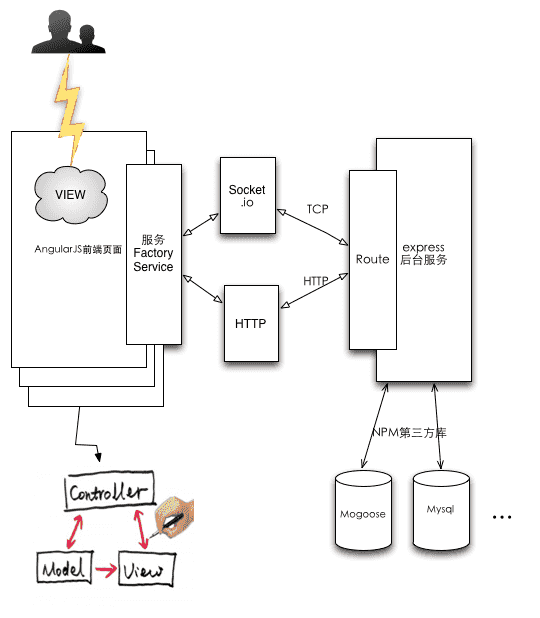
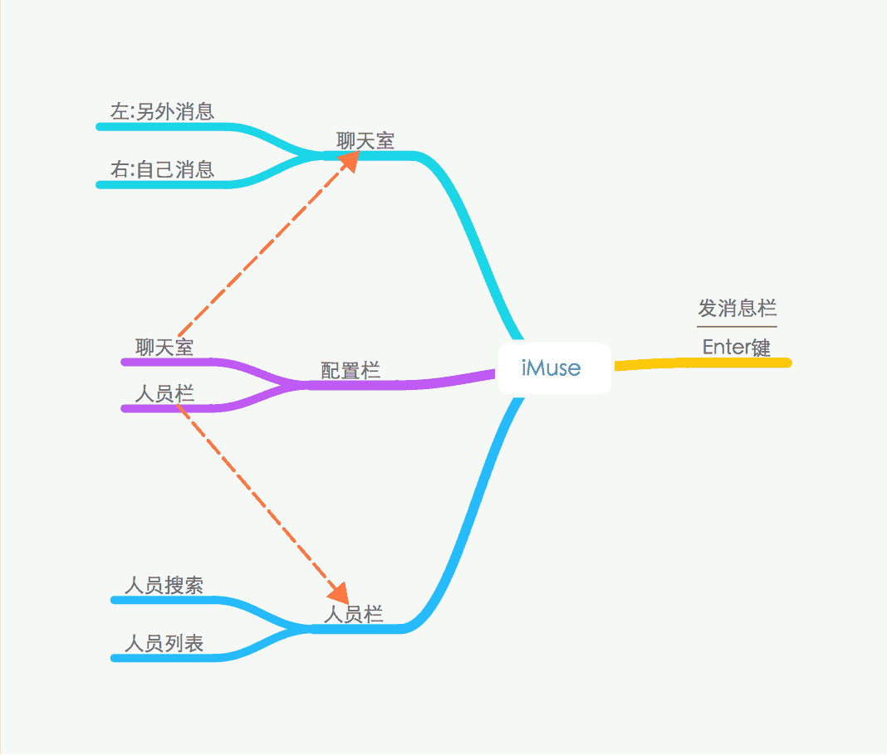
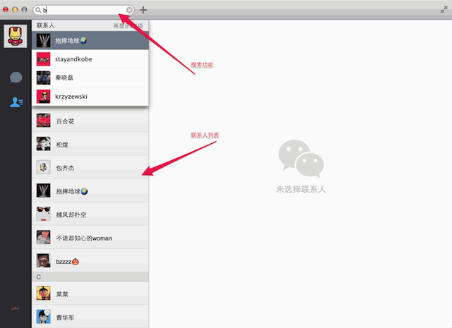
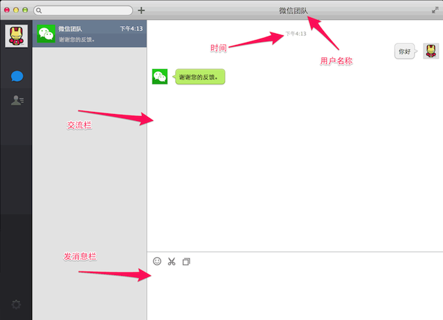
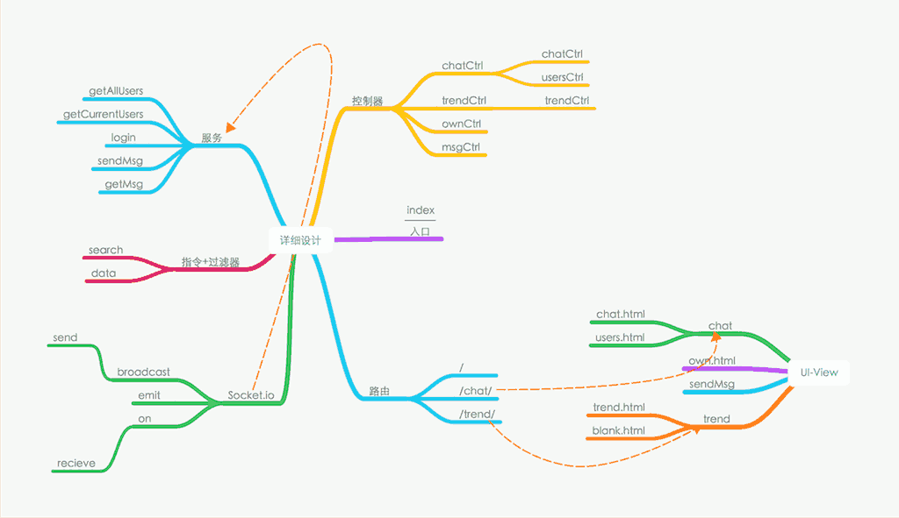
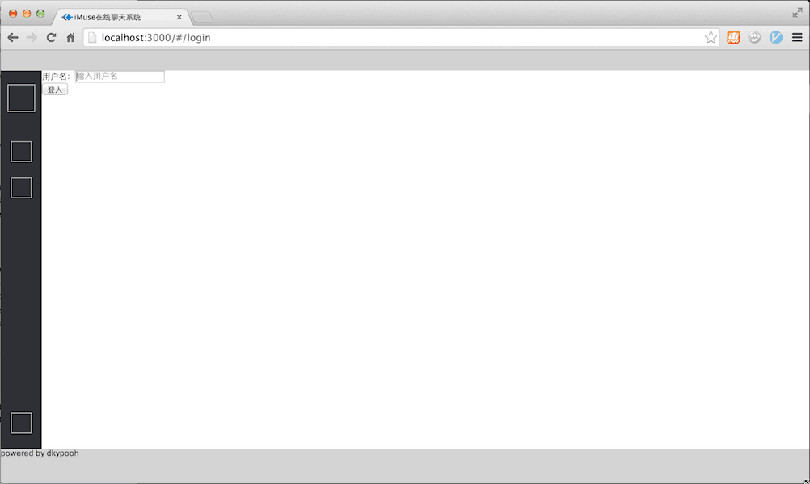
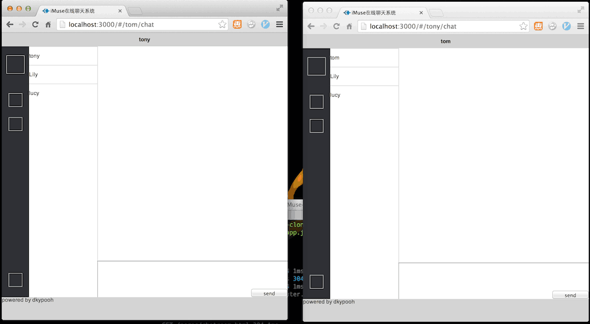
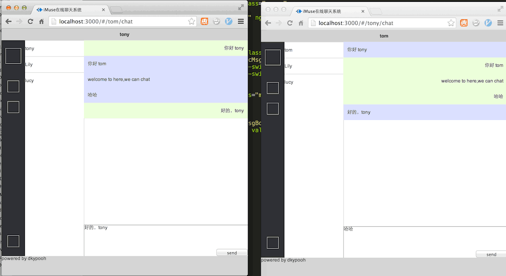

iMuse
=====

一个在线通信聊天系统，界面仿造WeChat，7.23 - 7.27建设中.....
CSS现在只写了布局，没有设计，到时候用bootstrap.css套用
#1.聊天系统设计			
> 

```
 + 前端使用AngularJs来实现数据绑定，实现UI高可用
 + 后台使用ExpressJs构建Web服务
 + Socket.io 事件响应处理方式传播消息
 + Mogoose存储数据
```

##1.1 前端界面设计
	
1. 脑图设计				
> 

2. 原型交互图 
> 		
------------
> 

##1.2 前端详细设计
>
>


##1.3 初步效果图			
+ 登入界面				
   

+ 两个客户端建立连接			
   

+ 双人会话				
   

----------
注：	
+ 7.23 设计为王，思想为主，抓住主干，程序的细节是最后考虑的,angularjs的使用方式还是有点不熟练，思想熟悉的还可以

